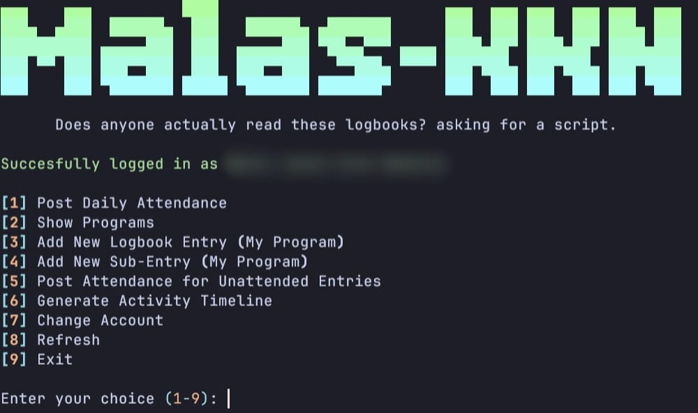

# KKN Attendance Automation

A simple program that manage your KKN-PPM UGM administrative works, which includes:

- Entering logbook entries and sub-entries
- Post attendance for logbook entries
- Daily attendance using the new VNEXT Checkpoint API



---

## Motivation

This program exist for a couple of reasons:

1. SIMASTER web UI is ass and the UX is even worse
2. The API handling is as consistent as my will to live (which is never /s)
3. I mean who doesn't like automation when the system is bad and time-consuming
4. I have free will

---

## Getting Started

There are currently only one way to run this, for planned feature see [TODO](#todo)

1. Clone the repository

```sh
git clone https://github.com/davinjason09/kkn-automation
cd kkn-automation
```

2. Setup the Python environment

- If you're using `pip`:
  - Set up a Virtual environment

    ```sh
    python -m venv .venv
    source .venv/bin/activate
    ```

  - Install the dependencies

    ```sh
    pip install -r requirements.txt
    ```

- If you're using [`uv`](https://github.com/astral-sh/uv/)

  ```sh
  uv sync
  ```

3. Create the Environment File \
   Create a file named `.env` in the project's root directory.

4. Configure your settings \
   Copy the template below into your `.env` or see [example](./.env.example).

```sh
# QR Code Location Value (Required)
QR_CODE_VALUE=the_qr_value

# KKN Location Settings (Required)
KKN_LOCATION_LATITUDE=-7.9547226
KKN_LOCATION_LONGITUDE=110.2788225
KKN_LOCATION_RADIUS_METERS=50

# A comma separated value for multiple usernames
USERNAMES=a,b,c,d

# SIMASTER credentials (Optional)
SIMASTER_USERNAME=username
SIMASTER_PASSWORD=password

# Gemini API Key (Optional)
GEMINI_API_KEY=
```

5. Run `main.py`

```text
usage: main.py [-s] [-c] [-h]

options:
  -s, --submit  (bool, default=False) Submit your attendance
  -c, --check   (bool, default=False) Check whether if you have logged in or not
  -h, --help    show this help message and exit

```

## Limitations

- It can only add logbook entries and sub-entries, if you wish to edit them, you have to edit them through the web.
- Group reports require each user's SIMASTER password (logbook data is per-session, not token-proxyable like check-in).
- No image/photo upload support (SIMASTER's photo endpoint not yet reverse-engineered).

## Daily Unattended Runs

The tool supports a **headless mode** (`--headless`) that skips all interactive
prompts and reads behavior from environment variables. This makes it safe to
schedule via GitHub Actions, `launchd`, or `cron`.

### CLI flags

```text
usage: main.py [-s] [-c] [-r] [--headless] [--dry_run] [--verify] [--group_report]

options:
  -s, --submit        Submit attendance for everyone in USERNAMES
  -c, --check         Check active session status for everyone in USERNAMES
  -r, --report        Generate attendance report (ICS + HTML + PDF) for the operator
      --headless      Run without interactive prompts (reads env vars)
      --dry_run       Validate everything but skip the final check-in POST
      --verify        After submit, verify each user's active session
      --group_report  Generate per-user reports for all SIMASTER_CREDENTIALS + group summary
  -h, --help          show this help message and exit
```

You can combine flags, e.g. `python src/main.py -s --headless --report --verify --group_report`
to submit attendance, verify it, and generate both operator + group reports in one headless run.

### Multi-location check-in

If your group is spread across multiple desa/sub-units, create a `locations.yaml`
file (see [`locations.example.yaml`](./locations.example.yaml)):

```yaml
locations:
  desa_a:
    qr_value: 11111
    latitude: -7.93
    longitude: 110.27
    radius: 50
  desa_b:
    qr_value: 22222
    latitude: -7.95
    longitude: 110.30
    radius: 50

user_locations:
  alice: desa_a
  bob: desa_b
  charlie: desa_a

default_location: desa_a
```

Each user is checked into their assigned location. Users not in `user_locations`
fall back to `default_location`. If no `locations.yaml` exists, the tool uses the
single `QR_CODE_VALUE` + `KKN_LOCATION_*` env vars for everyone.

### Testing & safeguards

- **`--dry_run`** — logs in, checks idempotency, resolves each user's location,
  prints "would check in X@Y" but does **not** POST. Safe for validating secrets.
- **Per-user summary** — at the end of each run, a table shows
  `✓ alice@desa_a  ✗ bob@desa_b (3 retries)  – charlie (skipped: already present)`.
- **`reports/result.json`** — machine-readable per-user result:
  `{username, location, status, attempts, verified, checked_in_at}`.
- **`--verify`** — after `--submit`, re-checks each user's active session to
  confirm the check-in actually registered.
- **Bounded retries** — `MAX_RETRIES` (default 3) with exponential backoff
  (`RETRY_BACKOFF`, default 2.0s). No more infinite loops.

### Option A: GitHub Actions (recommended — laptop can stay off)

A workflow is included at `.github/workflows/daily-attendance.yml`. It runs at
**10:00 WIB (03:00 UTC)** daily, submits attendance for everyone in `USERNAMES`,
verifies, generates per-user + group reports, uploads to Google Drive (if
configured), and uploads everything as artifacts (7-day retention). If the run
fails, GitHub emails you automatically.

To use it on your fork:

1. Fork this repo to your GitHub account.
2. In the fork, go to **Settings → Secrets and variables → Actions** and add:
   - `SIMASTER_USERNAME`, `SIMASTER_PASSWORD` (operator creds for check-in token)
   - `USERNAMES` (comma-separated, include yourself)
   - `QR_CODE_VALUE`, `KKN_LOCATION_LATITUDE`, `KKN_LOCATION_LONGITUDE`, `KKN_LOCATION_RADIUS_METERS`
   - `SIMASTER_CREDENTIALS` — JSON `{"alice":"pass1","bob":"pass2"}` (for group reports)
   - `AI_PROVIDER`, `OLLAMA_BASE_URL`, `OLLAMA_API_KEY`, `OLLAMA_MODEL`
   - `GDRIVE_SERVICE_ACCOUNT_JSON` — full service-account JSON (for Drive upload)
   - `GDRIVE_FOLDER_ID` — shared Drive folder ID
3. (Optional) Add `LOCATIONS_YAML` as a **variable** (not secret) in
   **Settings → Secrets and variables → Variables** if using multi-location.
4. Enable Actions in the fork's **Actions** tab.
5. The schedule fires daily. You can also trigger it manually via
   **Run workflow** in the Actions tab.

Your laptop does **not** need to be on — GitHub runs it in the cloud.

### Option B: launchd on macOS (laptop must be on or allowed to wake)

A template plist is at `docs/launchd/kkn-attendance.plist`.

1. Edit the paths in the plist (replace `YOUR_USERNAME` and the project path).
2. Copy to `~/Library/LaunchAgents/com.vityasyyy.kkn-attendance.plist`.
3. Load: `launchctl load ~/Library/LaunchAgents/com.vityasyyy.kkn-attendance.plist`.

`launchd` with `StartCalendarInterval` catches up missed runs on wake — if the
laptop was asleep at 10:00, the job runs shortly after you wake it.

### Option C: cron

```cron
0 10 * * * cd /path/to/kkn-automation && .venv/bin/python src/main.py -s --headless --report >> logs/cron.log 2>&1
```

### Env vars for headless behavior

| Variable | Default | Purpose |
|---|---|---|
| `IDEMPOTENT` | `true` | Skip check-in if user already has an active session |
| `THROTTLE` | `false` | Random 0–5s delay between usernames |
| `SHUFFLE` | `true` | Shuffle the check-in order |
| `MAX_RETRIES` | `3` | Bounded retry attempts on failure |
| `RETRY_BACKOFF` | `2.0` | Exponential backoff base (seconds) |
| `AI_PROVIDER` | `gemini` | `ollama` or `gemini` |
| `OLLAMA_BASE_URL` | — | Ollama Cloud endpoint (OpenAI-compatible) |
| `OLLAMA_API_KEY` | — | Bearer token for Ollama Cloud |
| `OLLAMA_MODEL` | `qwen2.5` | Model name for drafting + report narrative |
| `GEMINI_API_KEY` | — | Google Gemini API key (alternative provider) |
| `SIMASTER_CREDENTIALS` | — | JSON `{"user":"pass"}` for group reports |
| `GDRIVE_SERVICE_ACCOUNT_JSON` | — | Full service-account JSON for Drive upload |
| `GDRIVE_FOLDER_ID` | — | Shared Drive folder ID for report storage |

See [`.env.example`](./.env.example) for the full list including logging/cache paths.

## Report Generation

The tool generates reports in three formats:

- **ICS** — calendar file of attended sub-entries (import to Google Calendar / Apple Calendar)
- **HTML** — styled summary table with attendance counts + AI narrative
- **PDF** — printable version of the HTML report

When `AI_PROVIDER` is configured, an AI-generated Indonesian narrative summary
is embedded in the HTML/PDF. Works with Ollama Cloud or Gemini.

### Operator report (`--report`)

Generates a report for the operator's account (whoever's `SIMASTER_USERNAME` is
set). Uses the check-in token — no extra passwords needed. Written to `reports/`.

### Group report (`--group_report`)

Generates **per-user reports for the entire group**. Requires `SIMASTER_CREDENTIALS`
(JSON secret mapping each username to their SIMASTER password). For each user:

1. Logs in with their credentials
2. Fetches their main programs (proker) + assisted programs (bantu)
3. Generates ICS + HTML + PDF under `reports/{username}/{date}/`
4. Uploads to Google Drive under `{folder_id}/{username}/{date}/` (if configured)

A **group summary PDF** is also generated at `reports/group-summary/{date}-group-summary.pdf`
with a table showing each user's total/attended/missed counts.

If one user's login fails, the run continues with the others — their status is
recorded in `reports/group-result.json` as `login_failed`. The run exits 1 if
any user failed, 0 only if all succeeded.

### Report content — what to insert first

Reports are **read-only** — they reflect existing SIMASTER logbook state. They do
not create content. Before reports are useful, ensure:

1. **Logbook entries exist** in SIMASTER (created via TUI options 3/4, or manually via web)
2. **Sub-entries exist** with title/date/duration (TUI option 4 can AI-draft the
   description/result text via Ollama at creation time)
3. **Attendance status** comes from the daily check-in (`-s`)

The daily run does two independent things:
- **Check-in** (`-s`) → marks today's attendance (token-proxy, no per-user passwords)
- **Report** (`--report` / `--group_report`) → reads logbook + generates PDF (per-user passwords needed for group)

## TODO

- [x] Automation (GitHub Actions + headless mode)
- [x] Use [rich](https://github.com/textualize/rich) for a nicer UI
- [x] More features related to KKN
  - [x] Program caching to minimize request to SIMASTER
  - [x] Add entry to logbook
  - [x] ~Automate~ Handle attendance of those entry
  - [x] Report generation (HTML, PDF, ICS)
  - [x] Multi-location check-in (locations.yaml)
  - [x] Group reports with Google Drive upload
  - [x] Dry-run, verify, per-user summary, result.json
  - [ ] ~Handle case when we want to backdate (set the date to the current date, post attendance, then revert the date back)~

---
